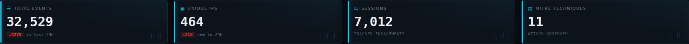
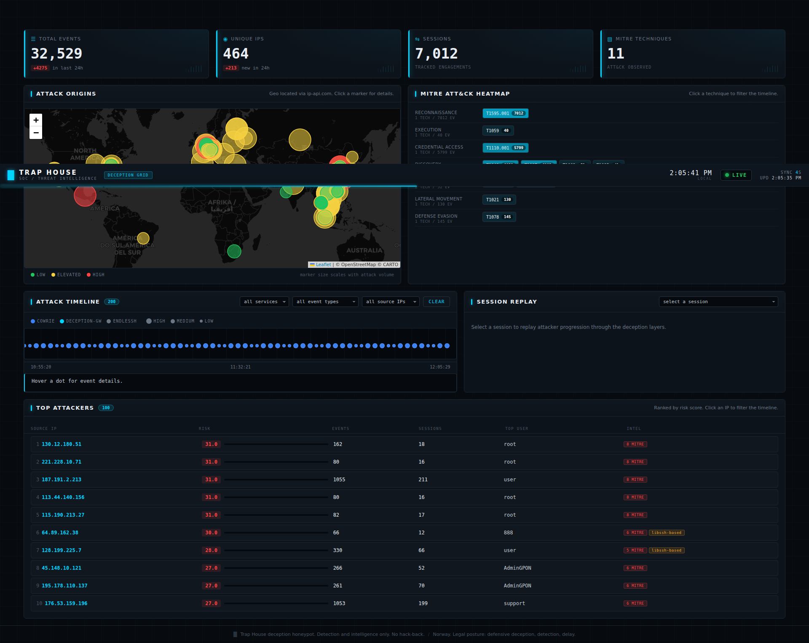
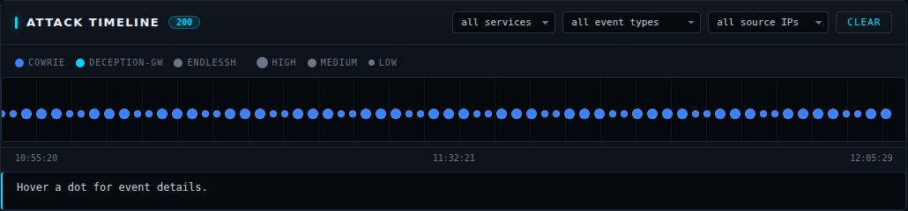

# Trap House

**A multi-layer deception honeypot that lures attackers into an endless maze of decoy services, then maps every move to MITRE ATT&CK.**

<a href="docs/img/outlaw-killchain.mp4"></a>

[Open the full 60 FPS MP4](docs/img/outlaw-killchain.mp4)

*The Outlaw or RedTail intrusion chain, reconstructed from the final live collection. Full analysis in [RESULTS.md](RESULTS.md) and [docs/final-report.md](docs/final-report.md).*

[](https://github.com/sssafeman/trap-house/actions/workflows/ci.yml)


Trap House simulates a fake company network that draws attackers into an infinite loop of decoy credentials and services. All attacker behavior is logged, mapped to MITRE ATT&CK techniques, and visualized on a custom threat intelligence dashboard. Detection and intelligence only: no hack-back, no offensive capability. Built for the Norwegian legal context ([LEGAL.md](LEGAL.md)).

## Final Results: 31 Days on the Open Internet

The live collection ran from 2026-06-30 to 2026-07-31 on a public VPS. The VPS is now powered off and the evidence is archived:

- 298,928 events
- 2,421 unique attacker IP addresses
- 66,299 sessions
- 12 MITRE ATT&CK technique IDs observed
- 54,143 authentication attempts
- 435 accepted decoy logins
- 437 file uploads
- 226 command execution events

The complete report is in [docs/final-report.md](docs/final-report.md).



> **Case study: repeated Outlaw or RedTail activity.** Source 130.12.180.51 produced 992 events across 75 sessions, 75 accepted decoy logins, 423 uploads, and 65 persistence and dropper command sequences. It prepared SSH key persistence with `chattr +ai`, detected the architecture, uploaded architecture-specific binaries, and attempted deployment. A second source replayed the same tooling pattern. The honeypot logged everything and executed nothing. Full breakdown in [RESULTS.md](RESULTS.md).


## What Makes It Different

Most student honeypot projects deploy Cowrie, collect some logs, and write a report. Trap House builds a full deception environment that keeps attackers engaged and produces professional-grade threat intelligence:

- **Custom deception middleware**: a purpose-built FastAPI fake corporate web app with 5 deception layers that route attackers in circles.
- **MITRE ATT&CK mapping**: two-layer detection. Static event-type mapping (11 techniques across 15 event mappings) plus regex pattern matching (10 patterns) that catches behavioral indicators like credential dumping, system discovery, and account enumeration.
- **Attacker profiling with risk scoring**: per-IP profiles tracking tools detected, MITRE techniques used, session count, and a weighted risk score.
- **Custom SOC dashboard**: dark-themed security operations center interface with a Leaflet attack map, MITRE heatmap, session replay showing the attacker's journey through the deception layers, and a filterable event timeline.
- **Sandboxed webshell**: file upload accepts webshells but executes against an in-memory fake filesystem. No real code execution, no subprocess, no eval. Every command is logged.
- **Legal by design**: built for the Norwegian legal context. Detection and intelligence only. No hack-back, no offensive capabilities. See [LEGAL.md](LEGAL.md).

## Architecture

9 Docker containers across 2 isolated networks. Full topology and data flow in [ARCHITECTURE.md](ARCHITECTURE.md).

```
                        Internet
                           │
                    ┌──────┴──────┐
                    │             │
              trap-external       │
                    │             │
           ┌────────┼──┬──────────┴───────┐
           │        │  │                  │
       endlessh    cowrie           deception-gw
       (tarpit)   (honeypot)          (FastAPI)
           │        │  │                  │
           └────┬───┴──┴──────────────────┘
                │
         trap-logs (bind mounts)
                │
        ┌───────┴────────┐
        │                │
   log-shipper      mitre-mapper
        │                │
        ▼                ▼
   SQLite DB       techniques table
   events table    attackers table
        │
   ┌────┴────┐
   │         │
 frontend   grafana + loki
 (SOC UI)   (metrics)
```

### External network (attacker-facing)

- **endlessh**: SSH tarpit. Accepts connections and drip-feeds a fake banner at 1 byte per second.
- **cowrie**: SSH/Telnet honeypot. Accepts credentials, provides a fake shell, logs all interaction as JSON. Serves a custom honeyfs with decoy `.env` files containing credentials that work on the web app.
- **deception-gw**: FastAPI fake corporate web app ("NordTech Solutions"). 5-layer deception maze with login, admin panel, SQL injection, sandboxed webshell, and fake AWS keys.

### Internal network (no external access)

- **socket-proxy**: scoped, read-only Docker API gateway. Lets log-shipper read Endlessh container logs without mounting the raw Docker socket.
- **log-shipper**: reads JSONL logs from all honeypot services, normalizes them to a shared event schema ([EVENT_SCHEMA.md](EVENT_SCHEMA.md)), writes to SQLite.
- **mitre-mapper**: reads events from SQLite, maps them to MITRE ATT&CK techniques using static and regex pattern matching, builds attacker profiles with risk scoring.
- **frontend**: custom FastAPI SOC dashboard with Leaflet attack map, MITRE heatmap, session replay, and event timeline. Host port bound to 127.0.0.1.
- **loki**: Grafana Loki log aggregation.
- **grafana**: Grafana dashboard for log-based metrics. Host port bound to 127.0.0.1.

The SQLite intel store is a file on a bind mount (`data/db/`), not a container.

## The Deception Maze

Attackers follow a path that looks like real network compromise but leads in circles:

1. **SSH entry (Cowrie)**: the attacker brute-forces SSH and gets in with weak credentials. They find a fake filesystem with `/home/admin/.env` containing database and web app credentials.
2. **Web login (deception-gw)**: decoy credentials from the `.env` file work on the fake NordTech Solutions corporate portal. Progressive authentication delay slows brute force attempts (2^n seconds, capped at 30).
3. **Admin panel and SQL injection**: the dashboard leads to an admin panel with user search. The search endpoint has an intentional (safe) SQL injection vulnerability. Injection returns 10,000 fake users. Optionally, email addresses can use a domain you control, set via `CANARY_EMAIL_DOMAIN`, to make later outbound use observable. The current implementation only logs locally.
4. **Webshell upload**: the admin panel accepts file uploads including `.php` webshells. The webshell "works" but executes against an in-memory fake filesystem. Commands like `whoami`, `uname -a`, `cat /etc/passwd` return believable fake output. No real execution.
5. **Fake AWS keys and maze loop**: the admin config page shows fake AWS access keys. The admin backup page shows database credentials that lead back to the login page. The attacker goes in circles.

Every interaction at every layer is logged as JSONL, normalized to the shared event schema, and mapped to MITRE ATT&CK techniques.

## The SOC Dashboard

A custom FastAPI frontend (vanilla JS, no build step) visualizes everything the honeypot captures. Reached over an SSH tunnel in production.



The Leaflet attack map plots attacker source geolocations on CartoDB Dark Matter tiles:


Attacker profiling ranks source IPs by a weighted risk score built from techniques used, tools detected, and session behavior:


The event timeline shows attack volume over time and supports filtering by event type and source:



## MITRE ATT&CK Coverage

The mapper heatmap on the dashboard shows observed technique frequency across tactics:


### Static event-type mapping (11 techniques, 15 event mappings)

| Technique | Name | Tactic |
|-|-|-|
| T1110.001 | Brute Force: Password Guessing | Credential Access |
| T1078 | Valid Accounts | Defense Evasion |
| T1059 | Command and Scripting Interpreter | Execution |
| T1190 | Exploit Public-Facing Application | Initial Access |
| T1505.003 | Server Software Component: Web Shell | Persistence |
| T1552.001 | Unsecured Credentials: Credentials In Files | Credential Access |
| T1083 | File and Directory Discovery | Discovery |
| T1049 | System Network Connections Discovery | Discovery |
| T1105 | Ingress Tool Transfer | Command and Control |
| T1021 | Remote Services | Lateral Movement |
| T1595.001 | Active Scanning: Scanning IP Blocks | Reconnaissance |

### Regex pattern matching (10 patterns)

| Technique | Trigger |
|-|-|
| T1110.004 | Credential stuffing tools (hydra, medusa, ncrack) |
| T1190 | Exploitation tools (sqlmap, nikto, nuclei, metasploit) |
| T1059.004 | Shell invocation (/bin/sh, powershell) |
| T1003.008 | Credential file access (cat /etc/passwd, /etc/shadow) |
| T1087 | Account discovery (whoami, id, net user) |
| T1082 | System info discovery (uname, hostname, arch) |
| T1083 | File discovery (ls, find, tree) |
| T1046 | Network scanning (nmap, masscan, netcat) |
| T1105 | Tool transfer (wget, curl, scp) |
| T1071.001 | HTTP C2 (curl/wget with http) |

## Tech Stack

- **Docker Compose**: 9-container orchestration, 2 isolated networks, images pinned by digest
- **Cowrie**: SSH/Telnet honeypot with custom honeyfs
- **Endlessh**: SSH tarpit
- **Python 3.12 / FastAPI**: deception middleware, log shipper, MITRE mapper, frontend API
- **SQLite**: intel store (events, sessions, techniques, attackers)
- **Grafana + Loki**: log aggregation and time-series metrics
- **Leaflet.js 1.9.4**: attack map with CartoDB Dark Matter tiles
- **Vanilla JS**: no frontend framework, no build step
- **itsdangerous**: signed session cookies for the deception maze
- **PyYAML**: MITRE technique configuration
- **Manim CE**: kill chain animation rendered from captured session data

## Project Structure

```
trap-house/
  docker-compose.yml          # Base configuration (9 containers, digest-pinned)
  docker-compose.prod.yml     # Production override (fail-closed secrets, Grafana lockdown)
  verify.sh                   # Smoke-test script for the honeypot layer
  Makefile                    # up, down, logs, test, clean
  LICENSE                     # MIT license
  RESULTS.md                  # Findings from the live deployment
  .env.example                # Dev environment config
  .env.hetzner.example        # Production environment config
  ARCHITECTURE.md             # System topology and data flow
  EVENT_SCHEMA.md             # Shared JSONL event schema
  LEGAL.md                    # Norwegian legal framework
  .github/workflows/ci.yml    # CI: byte-compile, compose validation, ShellCheck
  animations/
    outlaw_killchain.py       # Manim CE kill chain animation source
  config/
    mitre-techniques.yaml     # MITRE ATT&CK technique mappings
    grafana/
      provisioning/           # Grafana datasource and dashboard provisioning
  deploy/
    harden.sh                 # Host hardening script (firewall, SSH, fail2ban)
    deploy.sh                 # Production deployment script
    egress-firewall.sh        # Restrict honeypot outbound traffic (anti-pivot)
    prune-data.sh             # Enforce DB and log retention windows (cron)
  docs/
    final-report.md           # Final frozen collection report
    final-evidence-manifest.md # Evidence hashes and closure state
    PHASE2_DESIGN.md          # Deception middleware design spec
    PHASE4_DESIGN.md          # Dashboard design spec
    img/                      # Dashboard screenshots and kill chain animation
  scripts/
    capture_dashboard.py      # Reproduce dashboard screenshots and replay
    digest.sh                 # Historical VPS stats digest
  tests/
    test_data_integrity.py    # Redaction, session, and sandbox regression tests
  services/
    cowrie/
      cowrie.cfg              # Cowrie configuration overrides
      honeyfs/home/admin/     # Decoy .env and README files
      scripts/start_cowrie.py # Builds the custom filesystem at startup
    deception-gw/
      main.py                 # FastAPI app with 14 routes
      config.py               # Decoy credentials, AWS keys, session config
      maze.py                 # Session management and progressive delay
      logger.py               # JSONL event logger with MITRE mapping
      fake_fs.py              # In-memory webshell sandbox
      templates/              # 8 Jinja2 templates
    log-shipper/
      shipper.py              # Log normalizer, SQLite writer, Endlessh poller
    mitre-mapper/
      mapper.py               # MITRE mapping service, attacker profiler
    frontend/
      app.py                  # FastAPI serving 10 API endpoints + dashboard
      templates/              # Dashboard HTML
      static/css/             # Dark SOC theme
      static/js/              # Attack map, heatmap, session replay, timeline
```

## Quick Start (Development)

```bash
# Clone and configure
git clone https://github.com/sssafeman/trap-house
cd trap-house
cp .env.example .env

# Start all 9 containers
make up

# Verify honeypot services are running
make test

# Open the SOC dashboard in a browser
# http://localhost:8001

# Open Grafana in a browser
# http://localhost:3000
```

### Reproduce dashboard screenshots

With the frontend running, the capture utility writes the dashboard assets to
`docs/img/` by default:

```bash
python scripts/capture_dashboard.py
```

The frontend exposes only the most recent sessions by default. The utility
uses the frozen Outlaw replay session `594b9428ab28` automatically. Override it
when capturing another historical session:

```bash
TRAP_HOUSE_REPLAY_SESSION=<session-id> python scripts/capture_dashboard.py
```

## Historical Production Deployment Reference

The live collection used a Hetzner VPS. The host is now powered off. The commands below remain as a reference for a deliberate future redeployment.

```bash
# 1. Create a VPS: Frankfurt, Ubuntu 24.04, 2 vCPU, 4 GB RAM
#    Add SSH key at creation. Skip backups, managed DB, extra volume.

# 2. SSH in, give cloud-init a minute or two to finish, then clone
ssh root@your-vps-ip
apt-get update && apt-get install -y git
git clone https://github.com/sssafeman/trap-house /opt/trap-house

# 3. Create non-root user with passwordless sudo and your SSH key
useradd -m -s /bin/bash -G sudo your_username
mkdir -p /home/your_username/.ssh
cat /root/.ssh/authorized_keys > /home/your_username/.ssh/authorized_keys
chown -R your_username:your_username /home/your_username/.ssh
chmod 700 /home/your_username/.ssh && chmod 600 /home/your_username/.ssh/authorized_keys
echo "your_username ALL=(ALL) NOPASSWD: ALL" > /etc/sudoers.d/your_username

# 4. Run host hardening (firewall, fail2ban, Docker, unattended upgrades)
cd /opt/trap-house
bash deploy/harden.sh your_username

# 5. Test SSH on port 22 in a SECOND terminal before closing this one
ssh your_username@your-vps-ip

# 6. Configure production environment
cp .env.hetzner.example .env.hetzner
# Edit .env.hetzner:
#   SESSION_SECRET=$(python3 -c "import secrets; print(secrets.token_hex(32))")
#   GRAFANA_ADMIN_PASSWORD=<your password>
#   DOCKER_GID=$(getent group docker | cut -d: -f3)
nano .env.hetzner

# 7. Deploy (creates data directories, builds images, starts and verifies the stack)
sudo bash deploy/deploy.sh

# 8. Access dashboards via SSH tunnel
ssh -L 8001:localhost:8001 -L 3000:localhost:3000 your_username@your-vps-ip
# Then open:
#   http://localhost:8001  (SOC Dashboard)
#   http://localhost:3000  (Grafana, login: admin / your GRAFANA_ADMIN_PASSWORD)
```

### Production port mapping (deployed layout)

| Port | Service | Exposure |
|-|-|-|
| 22 | Host SSH (admin, key-only, root disabled) | External |
| 80 | Deception-gw (fake web app) | External |
| 2222 | Cowrie SSH honeypot | External |
| 2223 | Cowrie Telnet honeypot | External |
| 22222 | Endlessh tarpit | External |
| 3000 | Grafana | Loopback only (SSH tunnel) |
| 8001 | SOC Dashboard | Loopback only (SSH tunnel) |

## Security Posture

### Container security

- All images pinned by sha256 digest (never `:latest`)
- Most application containers drop ALL Linux capabilities, with `no-new-privileges` and resource ceilings applied where image startup permits
- `read_only` rootfs on the four Python services (deception-gw, log-shipper, mitre-mapper, frontend)
- Cowrie runs as UID 999; deception-gw, frontend, log-shipper, mitre-mapper run as UID 1000 (non-root)
- The socket proxy is limited to container reads with `POST=0`; its image-required HAProxy configuration path remains writable
- Per-service memory, PID, and CPU limits; json-file log rotation on every container
- The log-shipper reads the Docker API through a scoped, read-only socket-proxy, never the raw socket
- The core internal network has `internal: true`. Services needing explicit
  external egress are attached to the separate external network and covered by
  the host egress policy.
- The deception sandbox has no subprocess, eval, or os.system path. The Cowrie startup wrapper invokes only the pinned filesystem builder before the daemon
- Webshell sandbox is pure in-memory dict lookup with hard size ceilings, no real execution
- X-Forwarded-For is ignored unless a trusted proxy is declared, so logged source IPs cannot be spoofed

### Host security (production)

- UFW firewall: only honeypot ports (80, 2222, 2223, 22222) and host SSH (22) open
- SSH on port 22, root login disabled, password auth disabled, key-only
- fail2ban on SSH (3 retries, 2 hour ban)
- Unattended security upgrades enabled
- Grafana and frontend accessible only via SSH tunnel (bound to 127.0.0.1); Grafana anonymous access disabled
- `deploy/egress-firewall.sh` restricts honeypot outbound traffic so a compromised container cannot pivot or exfiltrate
- `deploy/prune-data.sh` enforces the database and log retention windows

### Legal

Norway. Detection and intelligence only. No hack-back, no offensive capabilities. See [LEGAL.md](LEGAL.md).

## How It Was Built

This project was built in 5 phases, each producing a deployable artifact:

1. **Phase 1**: Docker Compose skeleton, Cowrie, Endlessh, log-shipper to SQLite
2. **Phase 2**: deception middleware (FastAPI 5-layer maze, sandboxed webshell, SQL injection)
3. **Phase 3**: MITRE mapper with regex patterns and attacker profiling
4. **Phase 4**: SOC dashboard with Leaflet map, MITRE heatmap, session replay, timeline, Grafana/Loki
5. **Phase 5**: production deployment, host hardening, portfolio writeup

Each phase was verified before moving to the next. `verify.sh` is a smoke test for the honeypot layer: it starts the stack and checks that Endlessh and Cowrie are listening and logging, and that the container security constraints hold. See [RESULTS.md](RESULTS.md) for the final findings from the live deployment, including 298,928 events, 2,421 attacker IPs, 12 observed technique IDs, and the full Outlaw or RedTail case study.

## Historical Daily Digest Utility

The archived deployment included a script-only cron job that pulled honeypot stats
over SSH and saved a structured markdown digest. The VPS is powered off, so this
is retained as a historical operational utility rather than an active service:

```bash
# Run manually
bash scripts/digest.sh

# Output: digests/YYYY-MM-DD.md
```

The digest includes total events, unique IPs, 24h deltas, top attackers by risk score, MITRE technique counts, and the last 10 events. Useful for tracking attack growth over time and building portfolio data.

## License

MIT. See [LICENSE](LICENSE) for the license text and [LEGAL.md](LEGAL.md) for usage guidelines and the legal framework.

Built by Said ([sssafeman](https://github.com/sssafeman)).
