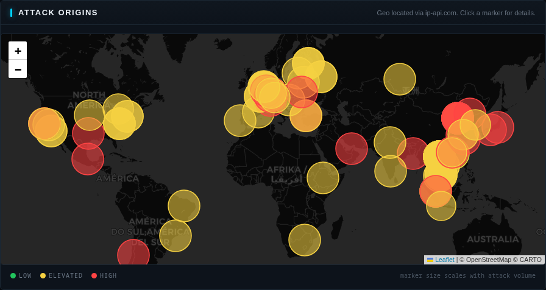
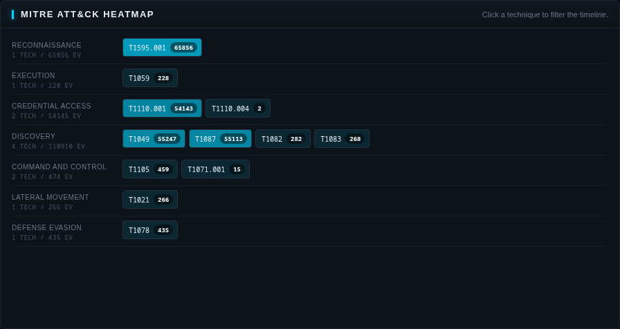
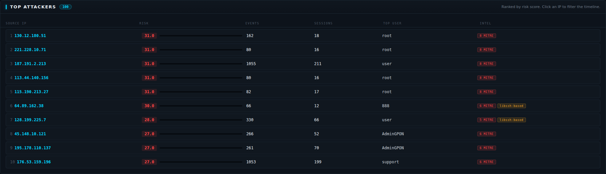
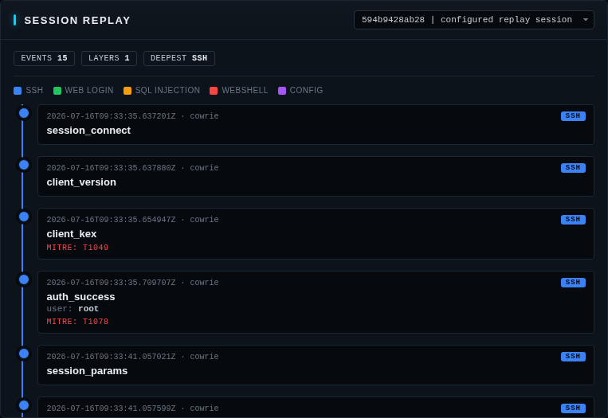
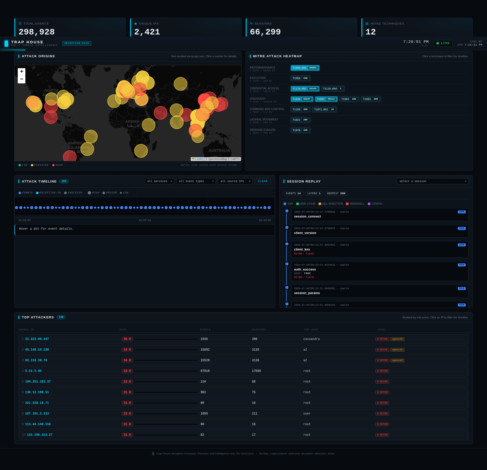

# Trap House: Results

Findings from the live deployment. The honeypot has been internet-facing on a
VPS since 2026-06-30, collecting real attacker traffic against the Cowrie SSH
honeypot, the Endlessh tarpit, and the deception web app.

> Data window: 2026-06-30 to 2026-07-16 (17 days). Figures below exclude the
> operator's own test traffic and the internal Docker gateway address.

## Volume

| Metric | Value |
|--------|-------|
| Total events captured | 178,389 |
| Unique attacker IP addresses | 1,467 |
| Distinct sessions | 37,189 |
| MITRE ATT&CK techniques observed | 13 |
| Events in last 24h | 6,131 |
| Events today (2026-07-16) | 1,920 |
| Latest event | 2026-07-16T11:48:59Z |

Traffic breaks down as Cowrie SSH (the large majority at 177,719 events), the
Endlessh tarpit (639), and the deception web app (31).

### Growth trajectory

| Date | Total events | Unique IPs | Sessions |
|------|-------------|------------|----------|
| 2026-07-01 | ~3,600 | ~175 | ~630 |
| 2026-07-04 | ~12,000 | ~280 | ~2,100 |
| 2026-07-08 | 31,788 | 416 | 6,886 |
| 2026-07-16 | 178,389 | 1,467 | 37,189 |

Traffic grew approximately 50x from the initial sample to the current window.
The acceleration in the second week reflects the honeypot being discovered by
automated scanner networks and added to shared target lists.

### Event type breakdown (DB query)

| Event type | Count |
|------------|-------|
| session_connect | 36,471 |
| session_disconnect | 36,471 |
| client_version | 35,479 |
| client_kex | 34,422 |
| auth_attempt | 33,927 |
| tarpit_connect | 639 |
| auth_success | 252 |
| file_upload | 175 |
| command_exec | 111 |
| unknown | 102 |
| proxy_request | 98 |
| proxy_data | 84 |

The connect/disconnect and client_version/kex pairs line up, which confirms
session accounting is consistent. The 252 auth_success events (against 33,927
auth_attempts) put the overall brute-force success rate at roughly 0.7%.

## MITRE ATT&CK Techniques Observed

| Technique | Name | Hits |
|-----------|------|------|
| T1595.001 | Active Scanning: Scanning IP Blocks | 37,110 |
| T1049 | System Network Connections Discovery | 34,422 |
| T1087 | Account Discovery | 34,395 |
| T1110.001 | Brute Force: Password Guessing | 33,927 |
| T1078 | Valid Accounts | 252 |
| T1021 | Remote Services | 182 |
| T1105 | Ingress Tool Transfer | 182 |
| T1082 | System Information Discovery | 134 |
| T1083 | File and Directory Discovery | 130 |
| T1059 | Command and Scripting Interpreter | 113 |
| T1071.001 | Application Layer Protocol: Web Protocols | 7 |
| T1110.004 | Credential Stuffing | 2 |

The distribution matches the expected opportunistic-attacker profile: mass
scanning and credential guessing, followed by post-access discovery commands
(`uname`, `whoami`, `ls`, reading `/etc/passwd`) once a weak password lands them
in the Cowrie shell.

**Mapper artifacts to flag:** T1049 (34,422 hits) and T1087 (34,395 hits) are
inflated by the MITRE mapper tagging pre-authentication events. T1049 maps to
every `client_kex` event, and T1087 maps to nearly every `auth_attempt` event.
In a real host, these techniques correspond to post-compromise commands like
`netstat` or `cat /etc/passwd`, not to the act of connecting or attempting
login. The counts are retained here for transparency about mapper output, but
should not be interpreted as genuine discovery activity. The
post-authentication techniques (T1082, T1105, T1083, T1059) are the reliable
signal.

### Technique coverage growth

Two techniques appeared after the initial sample period:
- T1110.004 (Credential Stuffing): 2 hits. Detection of hydra/medusa/ncrack
  tool signatures in command input.
- T1071.001 (Application Layer Protocol): 7 hits. HTTP C2 patterns in
  curl/wget commands.

T1105 (Ingress Tool Transfer) grew from 50 to 182 hits, and T1059 (Command
and Scripting Interpreter) from 40 to 113, reflecting increased file upload and
command execution activity as more attackers reached the fake shell.

## Authentication Analysis

The usernames attackers tried most were `root`, `admin`, `support`,
`cassandra`, and `a2`. The first three are consistent with the curated Cowrie
`userdb` accepting the planted `admin` decoy plus common weak `root` passwords.
Successful logins (T1078) lead attackers into the fake shell where the planted
`/home/admin/.env` steers them toward the deception web app.

### Auth success breakdown (DB query)

252 successful authentications total:

| Username | Successes | Distinct source IPs |
|----------|-----------|---------------------|
| root | ~125 | ~70 |
| admin | ~63 | ~19 |
| support | ~55 | ~5 |
| debian | ~4 | ~3 |
| cassandra | ~3 | ~2 |
| a2 | ~2 | ~1 |

The `support` account is notable: only 5 source IPs but ~55 successes. A
small number of attackers specifically targeted `support` and succeeded
repeatedly, a real-world credential reuse pattern worth flagging.

New usernames appeared in the latest window: `cassandra` and `a2`. These
correlate with the highest-risk attacker profiles (see below) and suggest
attackers are using updated credential lists that include application-specific
service accounts.

### Top attacker IPs by volume

| IP | Events | Notes |
|----|--------|-------|
| 5.31.5.95 | 87,818 | Single source, ~49% of all traffic. Automated, 17,565 sessions. |
| 101.201.76.235 | 21,302 | Alibaba Cloud (China). Dumb brute-forcer: all root, never succeeded. |
| 45.148.10.239 | 15,692 | 3,135 sessions, targeting username "a2". Risk score 34.0. |
| 103.158.206.141 | 6,422 | |
| 139.199.80.137 | 2,390 | Tencent Cloud. |
| 176.53.159.196 | 2,318 | DNS proxy abuse (see Proxy Abuse section). |

The 5.31.5.95 source alone generated nearly half of all events. 17,565 sessions
from a single IP over 17 days is consistent with a botnet node or distributed
scanner running continuous credential campaigns.

### Top attacker profiles by risk score

The MITRE mapper builds per-IP profiles tracking tools detected, techniques
used, session count, and a weighted risk score.

| IP | Events | Sessions | Risk | Top user | MITRE techniques |
|----|--------|----------|------|---------|-----------------|
| 31.223.60.247 | 1,935 | 386 | 36.0 | cassandra | 9 |
| 45.148.10.239 | 15,692 | 3,135 | 34.0 | a2 | 8 |
| 5.31.5.95 | 87,818 | 17,565 | 33.0 | root | 9 |
| 130.12.180.51 | 457 | 39 | 31.0 | root | 8 |
| 221.228.10.71 | 80 | 16 | 31.0 | root | 8 |

The 31.223.60.247 profile is the highest-risk attacker. It targets the
`cassandra` username, which is an application-specific service account, not a
default system user. This indicates a targeted credential list rather than
opportunistic spray. Combined with 9 MITRE techniques and 386 sessions, this
profile shows deliberate, sustained probing.

## Case Study: Outlaw/RedTail Cryptomining Campaign

The most significant intrusion captured during this window was a complete
Outlaw/RedTail cryptomining kill chain from a single source IP. This is the
centerpiece finding because it shows the full lifecycle of a deliberate
intrusion, not just opportunistic scanning.

### Attacker profile (DB query + session replay)

- Source IP: 130.12.180.51 (Saudi Arabia)
- First seen: 2026-06-30T07:05:52Z
- Last seen: 2026-07-07T22:23:44Z
- Events: 457
- Sessions: 39
- Risk score: 31.0
- MITRE techniques observed: 8
- Top username: root

### Threat intel corroboration (ThreatFox + VirusTotal)

ThreatFox confirms the delivered binaries are known Outlaw/RedTail malware:

- IOC 1820703: `redtail.x86_64`, malware family `elf.redtail`, confidence high
  (85%). Tags: elf, miner, Redtail, x86_64, xmrig. First seen 2026-06-01.
- IOC 1831959: `setup.sh`, malware family `elf.xmrig`. Tags: dota3, mdrfckr,
  miner, outlaw, ssh. Reported by nullblue67.
- The x86_64 binary scores 37/64 on VirusTotal (queried 2026-07-08).

### Kill chain (reconstructed from session replay and command_exec)

1. **T1110.001 Brute Force:** hammered `root`, succeeded (T1078). This attacker
   was one of ~70 distinct IPs that successfully authenticated as root.
2. **T1082 System Information Discovery:** ran `uname -s -m` to fingerprint
   architecture.
3. **T1105 Ingress Tool Transfer:** uploaded 6 files via SFTP to Cowrie,
   repeated 8 times between 2026-07-04 and 2026-07-07.
4. **Persistence:** injected an SSH `authorized_keys` entry, then locked it with
   `chattr +ai` (immutable attribute). The key was labeled
   `rsa-key-20230629`, a known Outlaw signature.
5. **T1059 Execution:** ran `chmod +x clean.sh; sh clean.sh; rm -rf clean.sh;
   chmod +x setup.sh; sh setup.sh; rm -rf setup.sh; ...` then `setup.sh`
   executed the architecture-matched `redtail` binary.

### Uploaded files (sha256 verified, captured to local evidence/ dir)

| File | Size (bytes) | sha256 |
|------|--------------|--------|
| clean.sh | 1,269 | 197c74408e15bd1168105f564f96aace4fd4819961b724630bf5a6be4878daf8 |
| setup.sh | 1,951 | 783adb7ad6b16fe9818f3e6d48b937c3ca1994ef24e50865282eeedeab7e0d59 |
| redtail.arm7 | 1,299,516 | 3625d068896953595e75df328676a08bc071977ac1ff95d44b745bbcb7018c6f |
| redtail.arm8 | 1,560,860 | dbb7ebb960dc0d5a480f97ddde3a227a2d83fcaca7d37ae672e6a0a6785631e9 |
| redtail.i686 | 1,748,196 | 048e374baac36d8cf68dd32e48313ef8eb517d647548b1bf5f26d2d0e2e3cdc7 |
| redtail.x86_64 | 1,880,264 | 59c29436755b0778e968d49feeae20ed65f5fa5e35f9f7965b8ed93420db91e5 |

### Script analysis (from captured binaries)

`clean.sh` is a competitor-killer (1,269 bytes):

- Stops and disables any existing `c3pool_miner` systemd service.
- Scrubs cron entries containing `wget`, `curl`, `/dev/tcp`, `/tmp`, `.sh`,
  `nc`, `bash -i`, `base64` from every cron location (hourly, daily, weekly,
  monthly, anacrontab, user crontabs).
- Wipes `/tmp`, `/var/tmp`, `/dev/shm`.
- Cleans `.bashrc`, `.bash_profile`, `.profile`.
- Kills processes named `systemtd`, `/bin/-bash`, `/usr/bin/.sh` (names that
  mimic legitimate system binaries).

`setup.sh` is the dropper (1,951 bytes):

- Generates a random filename to avoid detection.
- Detects architecture (x86_64, i686, arm8, arm7) via `uname -mp`.
- Finds a writable, executable directory outside `noexec` mounts.
- Copies the matching `redtail` binary there with a random name.
- Runs it with `./$FILENAME ssh`. The `ssh` argument is the RedTail C2 mode,
  meaning the binary reaches out to its controller over SSH.
- Deletes the `redtail.*` files to clean up.

The honeypot logged the commands and accepted the SFTP uploads but did not
execute the binaries, which is the correct behavior for a deception sensor.

## Secondary Campaign: Bash Dropper Stagers

Two IPs ran an identical, more modern dropper pattern. These are a separate
actor from the Outlaw/RedTail campaign above, not the same operator.

- 39.106.160.3 on 2026-07-04, pulling from 8.219.7.59:6859.
- 47.109.80.198 on 2026-07-08, pulling from 220.180.99.71:60105.

Pattern (identical in both, reconstructed from command_exec):

1. `echo 1 > /dev/null && cat /bin/echo` (shell fingerprinting, testing whether
   the fake shell behaves correctly).
2. `nohup` with a `curl`/`wget`/`/dev/tcp` fallback chain to download a `linux`
   binary to `/tmp`. The `/dev/tcp` fallback works even when `curl` and `wget`
   are absent, using the bash built-in TCP.
3. `head -c 3716336 > /tmp/...` writes exactly 3,716,336 bytes, a fixed-size
   payload.
4. Executes the binary with a large base64 blob as an argument (an encrypted C2
   config or session key).
5. `echo 123456 > /tmp/.opass` drops a marker file.

These map to T1105 Ingress Tool Transfer and T1059 Command and Scripting
Interpreter. The honeypot logged the commands but did not execute them, which
is the correct behavior.

## Proxy Abuse

Three IPs tried to relay traffic through the honeypot. These map to T1090
(Proxy), which the MITRE mapper does not tag yet. Noting the gap here so it can
be closed in a future mapper update.

| IP | Behavior | Events |
|----|----------|--------|
| 45.148.10.121 | STUN/TURN relay to 141.101.90.1:3478 (Cloudflare). VoIP or NAT traversal proxy. | 30 |
| 176.53.159.196 | DNS proxy to 1.1.1.1:53. Open DNS resolver, possible amplification. | 22 |
| 64.89.162.38 | HTTP proxy to itself on port 80. Open proxy check. | ~10 |

## Dominant noise source

101.201.76.235 (Alibaba Cloud, China): 21,302 events, ~12% of all traffic. A
dumb brute-forcer. 4,259 auth_attempt events, all username `root`, never
succeeded, never uploaded, never ran a command. It hammers `root` with a
password list and disconnects every 2 seconds. It is useful for the brute force
volume metric, not for TTPs. It is included here as the contrast between
automated noise and the deliberate intrusion in the case study above.

## Command Execution Breakdown

111 command_exec events total, in 4 categories:

1. `uname -s -m` or variants: ~55 events. Pure architecture fingerprinting, the
   bot's first question after login.
2. Outlaw `clean.sh` + `setup.sh` + persistence chain: ~5 events
   (130.12.180.51). The full campaign in command lines.
3. Bash dropper stager: ~8 events from 2 IPs (39.106.160.3, 47.109.80.198),
   identical pattern.
4. Filesystem discovery (`ls`, `cat /etc/passwd`, `find`): ~43 events.
   Standard post-access enumeration.

The honeypot logged all commands but executed none of the malicious payloads.
The webshell sandbox and Cowrie's fake shell handle this safely by design.

## File Uploads

175 file_upload events. The majority are the Outlaw campaign's 6 binaries
uploaded repeatedly across sessions. Additional uploads include configuration
files and shell scripts from other attackers. All uploads are captured to the
local `evidence/` directory (gitignored) with SHA256 hashes for further
analysis.

## Notable attacker behavior

Several source IPs ran full discovery sequences after logging in: enumerating
the filesystem, reading the decoy `.env`, and probing network configuration.
These are the sessions most worth reviewing in the SOC dashboard's session
replay, which reconstructs each attacker's path through the deception layers.

## Limitations and Defensive Takeaways

### Honeypot limitations

- Cowrie is a low-interaction SSH honeypot. It does not execute uploaded
  binaries, so the kill chain reconstruction stops at the execution step.
  Outbound C2 traffic, lateral movement, and actual mining behavior are not
  captured.
- The Endlessh tarpit only logs connection attempts. No attacker interaction
  beyond the TCP handshake is recorded.
- The deception web app is static and received minimal interaction during this
  window (31 events). No significant web-based attacks were observed.
- The MITRE mapper does not tag T1090 (Proxy) events. This is a known gap to
  address in a future mapper update.
- T1049 and T1087 counts are mapper artifacts from pre-authentication events,
  not genuine post-compromise discovery. See the note in the MITRE techniques
  section.

### Defensive takeaways

- The Outlaw/RedTail campaign demonstrates a repeatable pattern: brute force
  root, upload architecture-specific binaries, inject an SSH key with
  `chattr +ai`, and execute a dropper. Blue teams should alert on
  `authorized_keys` files with immutable attributes and on processes named
  `systemtd` or `/bin/-bash`.
- The `support` account credential reuse (~55 successes from only 5 IPs)
  suggests attackers share password lists targeting service accounts.
  Organizations should treat any account with a common weak password as a
  high-risk target.
- The `cassandra` and `a2` usernames in the latest window indicate attackers
  are using updated wordlists that include application-specific service
  accounts, not just system defaults.
- The bash dropper stagers use a `/dev/tcp` fallback, which bypasses
  traditional `curl`/`wget` detection. Network monitoring should look for
  outbound connections on arbitrary ports from shell processes.
- Proxy abuse attempts (STUN/TURN, DNS, HTTP) indicate the honeypot IP is
  being scanned for open relay capabilities. Blocking these at the network
  edge is recommended.

## Dashboard

The custom SOC dashboard visualizes all of the above: a Leaflet attack map
of source-IP geolocations, a MITRE ATT&CK heatmap, per-session replay, and a
filterable event timeline. Reach it over the SSH tunnel at
`http://localhost:8001`.












## Reproducing these numbers

The `scripts/digest.sh` script SSHes into the VPS, queries the SQLite intel
store, and writes a dated markdown summary (totals, unique IPs, 24h deltas,
top attackers by risk score, technique counts, recent events) to `digests/`.
This report is a curated snapshot of that data. The event-type and technique
counts above come from direct SQLite queries against the intel store at
`data/db/trap-house.db`.

```bash
bash scripts/digest.sh
# Output: digests/YYYY-MM-DD.md
```